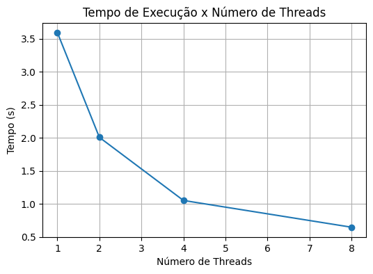
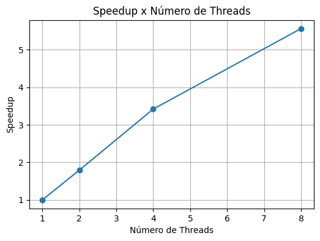

## 4. Estudo de Escalabilidade

Com o objetivo de avaliar o impacto da paralelização no desempenho da multiplicação de matrizes, foram realizados experimentos variando a quantidade de threads utilizadas na execução. Todos os testes foram conduzidos utilizando matrizes quadradas de ordem 1500, mantendo constante a carga de trabalho entre as diferentes configurações.

Para cada configuração, foi medido o tempo de execução da etapa de multiplicação, a partir do qual foram calculados o speedup e a eficiência. O speedup representa o ganho de desempenho obtido em relação à execução com apenas uma thread, enquanto a eficiência indica o aproveitamento dos recursos computacionais disponibilizados.

### Resultados

| Threads | Tempo (s) | Speedup | Eficiência |
| ------- | --------: | ------: | ---------: |
| 1       |    3.5960 |   1.000 |      1.000 |
| 2       |    2.0078 |   1.791 |      0.896 |
| 4       |    1.0521 |   3.418 |      0.855 |
| 8       |    0.6466 |   5.561 |      0.695 |

Os resultados mostram uma redução consistente no tempo de execução à medida que o número de threads aumenta. A execução com 8 threads apresentou um tempo aproximadamente 5,5 vezes menor que a execução utilizando apenas uma thread.

O speedup foi calculado pela expressão:

[
Speedup = \frac{T_1}{T_p}
]

onde (T_1) representa o tempo de execução utilizando uma única thread e (T_p) representa o tempo obtido com (p) threads.

A eficiência foi calculada por:

[
Eficiência = \frac{Speedup}{p}
]

sendo (p) o número de threads utilizadas na execução.

### Gráfico de Tempo

O gráfico a seguir apresenta a relação entre o número de threads e o tempo total de execução da multiplicação de matrizes.

Observa-se uma queda acentuada no tempo de execução conforme novas threads são adicionadas. O maior ganho ocorre nas primeiras duplicações do número de threads, comportamento típico de aplicações paralelas CPU-bound.

### Gráfico de Speedup

O gráfico seguinte apresenta a evolução do speedup em função do número de threads.

Nota-se que o speedup cresce continuamente com o aumento do paralelismo, porém não acompanha a linha ideal de crescimento linear. Ainda assim, os resultados demonstram um aproveitamento significativo dos recursos disponíveis, especialmente até a configuração com 4 threads.

### Discussão

Os experimentos confirmam que a multiplicação de matrizes é um problema altamente paralelizável. O tempo de execução diminuiu de 3,5960 segundos para 0,6466 segundos quando o número de threads foi aumentado de 1 para 8, resultando em um speedup de aproximadamente 5,56x.

Entretanto, o ganho obtido não é linear. Em um cenário ideal, a utilização de 8 threads produziria um speedup próximo de 8x, o que não foi observado na prática. Um dos fatores responsáveis por essa diferença é a existência de trechos inevitavelmente sequenciais da aplicação, conforme descrito pela Lei de Amdahl. Mesmo que a maior parte do trabalho seja paralelizável, operações como criação, gerenciamento e sincronização das threads permanecem sequenciais e limitam o ganho máximo possível.

Outro fator importante é o overhead introduzido pelas chamadas `pthread_create` e `pthread_join`. À medida que o número de threads aumenta, cresce também o custo associado à coordenação dessas threads. Além disso, todas as threads compartilham os mesmos recursos de hardware, especialmente memória principal e cache. Consequentemente, ocorre maior competição por largura de banda de memória e acesso aos níveis de cache do processador, reduzindo gradualmente a eficiência observada.

Esse comportamento pode ser percebido na tabela de resultados: enquanto a eficiência com 2 threads foi de aproximadamente 89,6%, com 8 threads ela caiu para cerca de 69,5%. Ainda assim, os resultados demonstram que a estratégia adotada de divisão por linhas foi eficaz, proporcionando ganhos expressivos de desempenho e confirmando a viabilidade do uso de programação concorrente para problemas computacionalmente intensivos.
